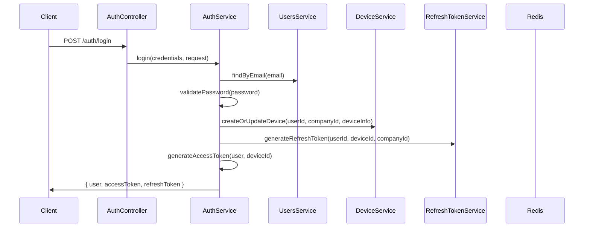

# 🏗️ System Architecture - Complete Documentation

## 🔐 **Authentication System (Kimlik Doğrulama)**

### **🎯 Temel Yapısı**

Authentication sistemi **JWT + Refresh Token** tabanlı, **device tracking** özellikli ve **token blacklisting** destekli bir yapıda.

#### **Kullanılan Servisler:**
```
src/modules/auth/services/
├── auth.service.ts              # Ana kimlik doğrulama servisi
├── token-blacklist.service.ts   # Token iptal yönetimi  
├── refresh-token.service.ts     # Refresh token yönetimi
├── device.service.ts            # Cihaz takibi
└── password-reset.service.ts    # Şifre sıfırlama
```

### **🔄 Authentication Akışı**



### **🛡️ Token Yönetimi**

#### **Access Token (JWT)**
```typescript
interface TokenPayload {
  sub: number;         // User ID
  email: string;       // User email
  firstName: string;   // User first name
  lastName: string;    // User last name
  systemRole: string;  // SUPERADMIN | ADMIN | MODERATOR | USER
  companyId: number;   // Company ID (multi-tenant)
  roles: string[];     // Company-specific roles
  permissions: string[]; // Flattened permissions from roles
  deviceId: string;    // Device identifier
  iat?: number;        // Issued at timestamp
}
```

#### **Refresh Token**
- Database'de saklanır (PostgreSQL)
- Device ile ilişkilendirilir
- Expire olduğunda otomatik silinir
- Kullanıldığında rotate edilir (güvenlik)

#### **Device Management**
```typescript
// Maksimum 5 cihaz per user
const MAX_DEVICES = 5;

// Device fingerprinting
deviceId = generateDeviceId(userAgent, ipAddress);

// Device info tracking
interface DeviceInfo {
  deviceId: string;
  deviceType: string;    // mobile, desktop, tablet
  deviceName?: string;
  browser?: string;
  os?: string;
  ip?: string;
  userAgent?: string;
}
```

### **🚫 Token Blacklisting (3-Level)**

Redis'te 3 seviyeli blacklist sistemi:

```typescript
// 1. Specific Token Blacklist
`blacklist:${token}` -> "true" (TTL: token expire süresine kadar)

// 2. User-Level Blacklist (logout-all)
`blacklist:user:${userId}` -> timestamp (TTL: JWT expire süresine kadar)

// 3. Device-Level Blacklist (logout-other-devices)  
`blacklist:device:${userId}:${deviceId}` -> timestamp
```

#### **Blacklist Kontrolü:**
```typescript
async isTokenBlacklisted(token: string): Promise<boolean> {
  // 1. Token kendisi blacklisted mi?
  if (await redis.get(`blacklist:${token}`)) return true;
  
  // 2. User'ın tüm tokenları blacklisted mi?
  const userBlacklistTime = await redis.get(`blacklist:user:${userId}`);
  if (userBlacklistTime && userBlacklistTime > tokenIssuedAt) return true;
  
  // 3. Device tokenları blacklisted mi?
  const deviceBlacklistTime = await redis.get(`blacklist:device:${userId}:${deviceId}`);
  if (deviceBlacklistTime && deviceBlacklistTime > tokenIssuedAt) return true;
  
  return false;
}
```

## 👥 **Authorization System (Yetkilendirme)**

### **🔒 UnifiedAuthGuard - 6 Katmanlı Kontrol**

```typescript
async canActivate(context: ExecutionContext): Promise<boolean> {
  // 1. PUBLIC ENDPOINT CHECK
  if (isPublic) return true;
  
  // 2. JWT AUTHENTICATION + BLACKLIST CHECK
  const user = await this.authenticateUser(request);
  if (!user) throw new UnauthorizedException();
  
  // 3. SYSTEM ROLE HIERARCHY
  this.checkSystemRoles(context, user);
  
  // 4. COMPANY ISOLATION (Multi-tenant)
  this.enforceCompanyIsolation(request, user);
  
  // 5. RBAC PERMISSIONS CHECK
  this.checkPermissions(context, user);
  
  // 6. COMPANY ROLES CHECK
  this.checkCompanyRoles(context, user);
  
  return true;
}
```

### **👑 System Role Hierarchy**

```
SUPERADMIN (en yüksek yetki)
├── Tüm şirketlere erişim
├── Tüm permission'ları bypass
├── Company isolation'ı bypass
└── Global sistem yönetimi

ADMIN (şirket düzeyinde yetki)
├── Kendi şirketindeki tüm veriler
├── User yönetimi
└── Şirket ayarları

MODERATOR (orta düzey yetki)
├── Sınırlı user yönetimi  
└── İçerik moderasyonu

USER (temel kullanıcı)
├── Sadece kendi verileri
└── Temel işlemler
```

### **🎨 Authorization Decorator'ları**

```typescript
// Public erişim
@Public()
@Get('health')
async health() {}

// Temel authentication
@RequireAuth()
@Get('profile') 
async getProfile() {}

// System role requirement
@RequireAuth("ADMIN")
@Get('admin-dashboard')
async adminDashboard() {}

// Permission requirement (AND logic)
@Permissions('users.read', 'users.write')
@Get('users')
async getUsers() {}

// Company role requirement (OR logic)
@Roles('manager', 'supervisor') 
@Get('team-reports')
async getTeamReports() {}

// SuperAdmin only
@SuperAdminOnly()
@Get('system-stats')
async getSystemStats() {}

// Complex requirements
@RequireAuth(["ADMIN", "users.write"]) // ADMIN AND users.write
async complexOperation() {}
```

## 🏢 **Company System (Multi-Tenancy)**

### **🎯 Multi-Tenant Mimari**

Sistem **company-based isolation** ile çalışır. Her veri bir company'ye ait ve strict isolation vardır.

#### **Database Schema Relations:**
```prisma
model Company {
  id        Int           @id @default(autoincrement())
  name      String
  slug      String        @unique
  domain    String?       @unique
  status    CompanyStatus @default(ACTIVE)
  settings  Json?
  
  // Relations - Tüm veriler company'ye bağlı
  users         User[]
  roles         Role[]
  permissions   Permission[]
  devices       Device[]
  refreshTokens RefreshToken[]
}

model User {
  id               Int         @id @default(autoincrement())
  email            String      @unique
  systemRole       SystemUserRole @default(USER)
  companyId        Int         @map("company_id")
  
  // Relations
  company          Company           @relation(fields: [companyId], references: [id])
  roles            UserRole[]        # Company-specific roles
  devices          Device[]
  refreshTokens    RefreshToken[]
}
```

### **🔒 Company Isolation**

#### **Regular Users:**
```typescript
// Guard'da company isolation
if (user.systemRole !== "SUPERADMIN") {
  if (!user.companyId) {
    throw new ForbiddenException("User must belong to a company");
  }
  
  // Her request'e company context eklenir
  request.companyId = user.companyId;
  request.company = { 
    id: user.companyId, 
    isSuperAdminContext: false 
  };
}
```

#### **SuperAdmin Context:**
```typescript
// SuperAdmin için flexible context
if (user.systemRole === "SUPERADMIN") {
  // Query parameter'dan target company
  const targetCompanyId = request.query?.companyId ? 
    parseInt(request.query.companyId) : user.companyId;
  
  request.companyId = targetCompanyId || null;
  request.company = {
    id: targetCompanyId || null,
    isSuperAdminContext: true,
    isGlobalAccess: !targetCompanyId,
    originalCompanyId: user.companyId
  };
}
```

#### **Service Level Isolation:**
```typescript
// UsersService'te otomatik filtering
async findAll(page = 1, limit = 10, companyId?: number) {
  const where = companyId ? { companyId } : {}; // SuperAdmin için optional
  
  return this.prisma.user.findMany({
    where,
    // ... diğer parametreler
  });
}
```

## 🎭 **RBAC System (Role-Based Access Control)**

### **📊 RBAC Database Schema**

```
Company (1) ←→ (N) Permission    # Her company'nin kendi permissions'ı
Company (1) ←→ (N) Role          # Her company'nin kendi rolleri  
Role (N) ←→ (N) Permission       # RolePermission junction table
User (N) ←→ (N) Role            # UserRole junction table
```

### **🔑 Permission Sistemi**

#### **Permission Format:**
```typescript
// Permission naming convention
resource.action

// Örnekler:
"users.read"           # User listesini görme
"users.write"          # User oluşturma/güncelleme
"users.delete"         # User silme
"company.settings"     # Company settings erişimi
"reports.admin"        # Admin raporları
"billing.manage"       # Faturalama yönetimi
```

#### **Permission Loading:**
```typescript
// JWT token'a permissions nasıl eklenir
private extractPermissions(userRoles: any[]): string[] {
  const permissions = new Set<string>();
  
  userRoles.forEach((userRole) => {
    userRole.role.permissions.forEach((rolePermission: any) => {
      permissions.add(rolePermission.permission.name);
    });
  });
  
  return Array.from(permissions);
}

// Database query - tüm ilişkiler dahil
const user = await prisma.user.findUnique({
  where: { email },
  include: {
    company: true,
    roles: {
      include: {
        role: {
          include: {
            permissions: {
              include: { permission: true }
            }
          }
        }
      }
    }
  }
});
```

### **🔄 Role Management & Cache Invalidation**

#### **Role Assignment'ta Token Invalidation:**
```typescript
// src/modules/roles/roles.service.ts
async assignRoleToUser(userId: number, roleId: number, companyId: number): Promise<void> {
  // 1. Role assignment yap
  await this.prisma.userRole.create({
    data: { userId, roleId }
  });
  
  // 2. User'ın tüm tokenlarını invalidate et
  await this.authService.invalidateUserPermissions(userId);
}

async addPermissionToRole(roleId: number, permissionId: number, companyId: number): Promise<void> {
  // 1. Permission assignment yap
  await this.prisma.rolePermission.create({
    data: { roleId, permissionId }
  });
  
  // 2. Bu role'e sahip tüm userların tokenlarını invalidate et
  const usersWithRole = await this.prisma.userRole.findMany({
    where: { roleId },
    select: { userId: true }
  });
  
  const userIds = usersWithRole.map(ur => ur.userId);
  await this.authService.invalidateUsersPermissions(userIds);
}
```

## 🔄 **Data Flow & Request Lifecycle**

### **📈 Complete Request Flow**

```
1. 🌐 HTTP Request
   ↓
2. 🛡️ CORS + Helmet + Rate Limiting  
   ↓
3. 🔍 UnifiedAuthGuard Activation
   ├── Public check (@Public)
   ├── JWT validation + blacklist check
   ├── System role hierarchy
   ├── Company isolation
   ├── Permission check (@Permissions)  
   └── Company role check (@Roles)
   ↓
4. 🎯 Controller Method
   ├── @CurrentUser() decorator → user info
   ├── @CurrentCompany() decorator → company info
   └── Business logic
   ↓
5. 📊 Service Layer
   ├── Company-filtered queries
   ├── Permission-based data access
   └── Business logic execution
   ↓
6. 🗃️ Database Layer (Prisma)
   ├── Company isolation filters
   ├── RBAC constraints
   └── Data retrieval
   ↓
7. 📤 Response Interceptors
   ├── Performance logging
   ├── Response sanitization  
   ├── Audit logging
   └── Error handling
   ↓
8. 📱 Client Response
```

### **💾 Database Relations Map**

```
┌─────────────┐    1:N    ┌──────────────┐    N:M    ┌─────────────┐
│   Company   │◄──────────┤     User     ├──────────►│    Role     │
│             │           │              │           │             │
│ - id        │           │ - id         │           │ - id        │
│ - name      │           │ - email      │           │ - name      │
│ - slug      │           │ - systemRole │           │ - companyId │
│ - status    │           │ - companyId  │           └─────────────┘
└─────────────┘           │ - status     │                  │
       │                  └──────────────┘                  │ N:M
       │ 1:N                      │ 1:N                     │
       ▼                          ▼                         ▼
┌─────────────┐           ┌──────────────┐         ┌─────────────┐
│ Permission  │           │    Device    │         │UserRole     │
│             │           │              │         │(Junction)   │
│ - id        │           │ - id         │         │             │
│ - name      │           │ - deviceId   │         │ - userId    │
│ - resource  │           │ - userId     │         │ - roleId    │
│ - action    │           │ - companyId  │         └─────────────┘
│ - companyId │           │ - isActive   │         
└─────────────┘           └──────────────┘         
       │ N:M                      │ 1:N            
       ▼                          ▼                
┌─────────────┐           ┌──────────────┐         
│RolePermiss. │           │RefreshToken  │         
│(Junction)   │           │              │         
│             │           │ - id         │         
│ - roleId    │           │ - token      │         
│ - permissId │           │ - userId     │         
└─────────────┘           │ - deviceId   │         
                          │ - companyId  │         
                          │ - expiresAt  │         
                          └──────────────┘         
```

## 🎯 **Key Security Features**

### **🔐 Authentication Security:**
- ✅ JWT short expiration (1h default)
- ✅ Refresh token rotation
- ✅ Device-based session management (max 5)
- ✅ 3-level token blacklisting
- ✅ Password hashing (bcrypt)
- ✅ Device fingerprinting

### **🛡️ Authorization Security:**
- ✅ Multi-layered authorization (6 levels)
- ✅ Strict company data isolation
- ✅ Granular permission system
- ✅ Role hierarchy enforcement
- ✅ Permission cache invalidation
- ✅ Comprehensive audit logging

### **🏢 Multi-tenancy Security:**
- ✅ Complete data segregation by company
- ✅ SuperAdmin global access control
- ✅ Company-specific roles & permissions
- ✅ Isolated user management
- ✅ Tenant-aware API endpoints

## 🚀 **Performance Optimizations**

### **⚡ Caching Strategy:**
- JWT'de permission caching (DB query reduction)
- Redis-based token blacklist (fast lookup)
- Company/user data caching with invalidation
- Selective database includes (only needed relations)

### **📊 Database Optimizations:**
- Efficient indexes on foreign keys
- Composite unique constraints
- Cascade deletes for data integrity
- Pagination support for large datasets

### **🔍 Monitoring & Observability:**
- Comprehensive request/response logging
- Performance metrics tracking
- Error correlation with request IDs
- Audit trail for security events
- OpenTelemetry distributed tracing

---

**Bu sistem production-ready, enterprise-grade security patterns kullanarak tasarlanmıştır. Multi-tenancy, RBAC, device management ve comprehensive logging ile tam kapsamlı bir authentication & authorization sistemidir.**