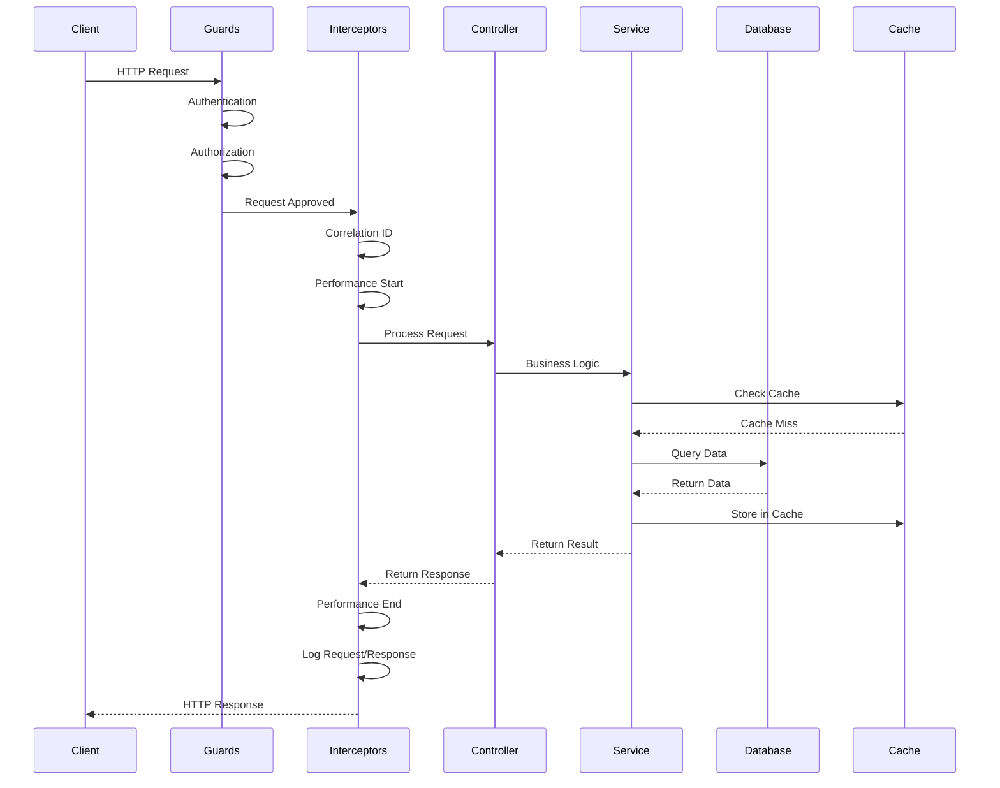

# 🏗️ Architecture Overview

## System Architecture

The NestJS Enterprise Template follows a modular, layered architecture designed for scalability, maintainability, and enterprise-level requirements.

## 📊 High-Level Architecture

```
┌─────────────────────────────────────────────────────────────────┐
│                          API Gateway                             │
│                     (nginx/load balancer)                       │
└─────────────────────────┬───────────────────────────────────────┘
                          │
┌─────────────────────────▼───────────────────────────────────────┐
│                     NestJS Application                          │
│  ┌─────────────┐ ┌─────────────┐ ┌─────────────┐ ┌───────────┐ │
│  │   Auth      │ │    Users    │ │  Companies  │ │   Roles   │ │
│  │   Module    │ │   Module    │ │   Module    │ │  Module   │ │
│  └─────────────┘ └─────────────┘ └─────────────┘ └───────────┘ │
│  ┌─────────────┐ ┌─────────────┐ ┌─────────────┐ ┌───────────┐ │
│  │   Health    │ │   Email     │ │   Upload    │ │  Security │ │
│  │   Module    │ │   Module    │ │   Module    │ │  Module   │ │
│  └─────────────┘ └─────────────┘ └─────────────┘ └───────────┘ │
└─────────────────────────┬───────────────────────────────────────┘
                          │
    ┌─────────────────────┼─────────────────────┐
    │                     │                     │
┌───▼────┐       ┌────────▼────────┐       ┌───▼────┐
│PostgreSQL│     │    MongoDB      │       │ Redis  │
│(Primary DB)│   │ (Logging DB)    │       │(Cache) │
└────────┘       └─────────────────┘       └────────┘
```

## 🎯 Core Principles

### 1. **Modular Design**
- Each feature is encapsulated in its own module
- Clear separation of concerns
- Loosely coupled, highly cohesive modules

### 2. **Layered Architecture**
```
┌─────────────────┐
│   Controllers   │  ← HTTP Layer
├─────────────────┤
│    Services     │  ← Business Logic
├─────────────────┤
│  Repositories   │  ← Data Access
├─────────────────┤
│    Database     │  ← Persistence
└─────────────────┘
```

### 3. **Dependency Injection**
- All dependencies are injected through NestJS DI container
- Enables easy testing and mocking
- Promotes loose coupling

## 🛡️ Security Layers

### Layer 1: Infrastructure Security
- **Helmet.js**: Security headers
- **CORS**: Cross-origin resource sharing
- **Rate Limiting**: Request throttling

### Layer 2: Authentication
- **JWT Tokens**: Stateless authentication
- **Refresh Tokens**: Long-term session management
- **Device Tracking**: Multi-device session management

### Layer 3: Authorization
- **RBAC**: Role-based access control
- **Company Isolation**: Multi-tenant data segregation
- **Permission Guards**: Fine-grained access control

### Layer 4: Data Validation
- **Input Sanitization**: XSS prevention
- **DTO Validation**: Type-safe data transfer
- **Schema Validation**: Database constraints

## 📦 Module Structure

### Core Modules

#### **AuthModule**
```typescript
auth/
├── controllers/
│   └── auth.controller.ts
├── services/
│   ├── auth.service.ts
│   ├── device.service.ts
│   └── token.service.ts
├── guards/
│   └── jwt.guard.ts
└── strategies/
    └── jwt.strategy.ts
```

#### **UsersModule**
```typescript
users/
├── controllers/
│   └── users.controller.ts
├── services/
│   └── users.service.ts
├── dto/
│   ├── create-user.dto.ts
│   └── update-user.dto.ts
└── entities/
    └── user.entity.ts
```

### Shared Modules

#### **DatabaseModule**
- Prisma ORM configuration
- Connection pooling
- Transaction management

#### **CacheModule**
- Redis configuration
- Cache strategies
- TTL management

#### **LoggerModule**
- Winston configuration
- MongoDB logging
- Structured logging

## 🔄 Request Lifecycle



## 💾 Data Flow

### Primary Data Flow (PostgreSQL)
```
User Request → Controller → Service → Prisma → PostgreSQL
```

### Logging Data Flow (MongoDB)
```
Request/Response → Interceptor → Winston → MongoDB
```

### Caching Data Flow (Redis)
```
Service → Redis Check → Cache Hit/Miss → Database → Cache Store
```

## 🔌 External Integrations

### Database Connections
- **PostgreSQL**: Primary application data
- **MongoDB**: Structured logging
- **Redis**: Caching and sessions

### External Services
- **Email Service**: Transactional emails
- **File Storage**: Upload handling
- **Monitoring**: Health checks and metrics

## 📊 Scalability Patterns

### Horizontal Scaling
- Stateless application design
- Load balancer compatible
- Redis-based session storage

### Vertical Scaling
- Connection pooling
- Query optimization
- Efficient caching

### Database Scaling
- Read replicas support
- Connection pooling
- Query optimization

## 🏢 Multi-Tenant Architecture

### Company Isolation
```typescript
// Every request includes company context
@Get()
@UseGuards(JwtGuard, CompanyGuard)
async findAll(@CurrentCompany() company: Company) {
  return this.service.findAll(company.id);
}
```

### Data Segregation
```sql
-- All tables include companyId
SELECT * FROM users WHERE company_id = ?;
SELECT * FROM roles WHERE company_id = ?;
```

## 🔧 Configuration Management

### Environment-Based Configuration
```typescript
@Injectable()
export class ConfigurationService {
  get jwtConfig() { ... }
  get databaseConfig() { ... }
  get redisConfig() { ... }
}
```

### Feature Flags
```typescript
// Conditional module loading
const modules = [
  CoreModule,
  ...(config.swagger.enabled ? [SwaggerModule] : []),
];
```

## 📈 Performance Optimizations

### Database Optimizations
- Prisma query optimization
- Connection pooling
- Index strategies

### Caching Strategies
- Application-level caching
- Database query caching
- HTTP response caching

### Memory Management
- Efficient data structures
- Garbage collection optimization
- Memory leak prevention

---

## 🔗 Related Documentation

- [[Security Architecture]] - Detailed security implementation
- [[Database Design]] - Database schema and relationships
- [[Multi-Tenant Design]] - Multi-tenancy patterns
- [[Performance Monitoring]] - Performance tracking and optimization