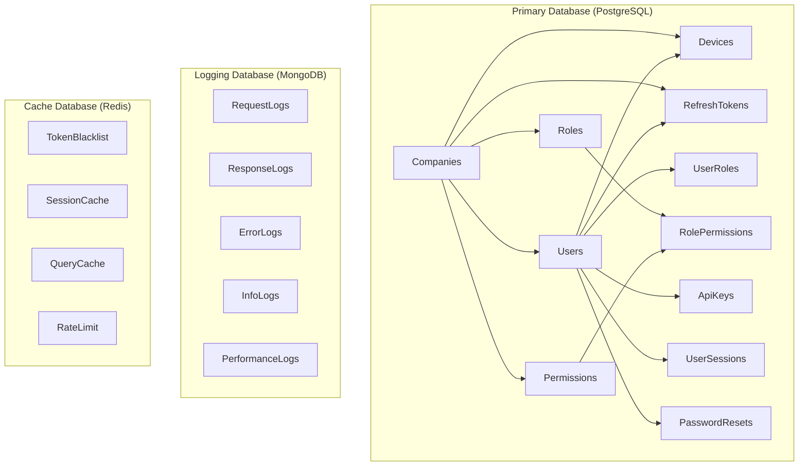
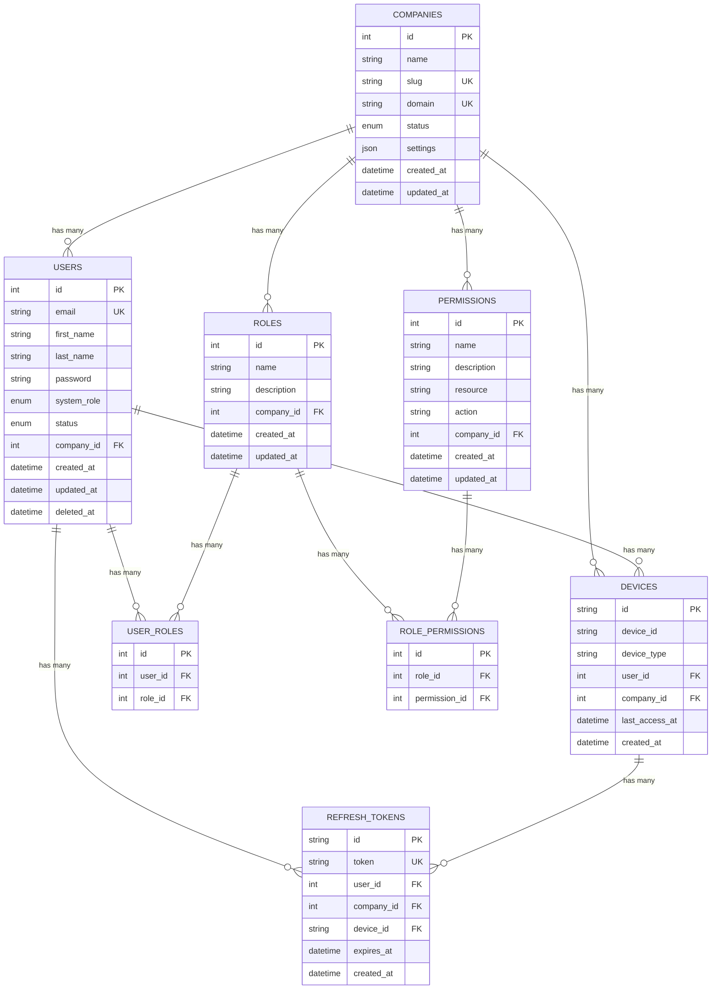

# 💾 Database Design

The NestJS Enterprise Template uses a sophisticated multi-database architecture with PostgreSQL as the primary database, MongoDB for logging, and Redis for caching and sessions.

## 🏗️ Database Architecture



## 📊 Primary Database (PostgreSQL)

### Core Tables

#### Companies (Multi-Tenant Root)
```sql
CREATE TABLE companies (
    id SERIAL PRIMARY KEY,
    name VARCHAR NOT NULL,
    slug VARCHAR UNIQUE NOT NULL,
    domain VARCHAR UNIQUE,
    status company_status DEFAULT 'ACTIVE',
    settings JSONB,
    created_at TIMESTAMP DEFAULT NOW(),
    updated_at TIMESTAMP DEFAULT NOW()
);
```

**Key Features:**
- **Tenant Isolation**: All data is scoped by `company_id`
- **Unique Slug**: URL-friendly company identifier
- **Domain Mapping**: Optional custom domain support
- **Status Management**: Active/Inactive/Suspended states
- **Flexible Settings**: JSON configuration storage

#### Users
```sql
CREATE TABLE users (
    id SERIAL PRIMARY KEY,
    email VARCHAR UNIQUE NOT NULL,
    first_name VARCHAR NOT NULL,
    last_name VARCHAR NOT NULL,
    password VARCHAR NOT NULL,
    system_role system_user_role DEFAULT 'USER',
    status user_status DEFAULT 'ACTIVE',
    avatar VARCHAR,
    phone_number VARCHAR,
    email_verified BOOLEAN DEFAULT FALSE,
    email_verified_at TIMESTAMP,
    last_login_at TIMESTAMP,
    password_changed_at TIMESTAMP,
    company_id INTEGER NOT NULL REFERENCES companies(id) ON DELETE CASCADE,
    created_at TIMESTAMP DEFAULT NOW(),
    updated_at TIMESTAMP DEFAULT NOW(),
    deleted_at TIMESTAMP -- Soft delete
);

CREATE INDEX idx_users_company_id ON users(company_id);
CREATE INDEX idx_users_email ON users(email);
CREATE INDEX idx_users_status ON users(status);
```

**Key Features:**
- **Multi-Tenant**: Scoped by `company_id`
- **System Roles**: SUPERADMIN, ADMIN, MODERATOR, USER
- **Soft Delete**: `deleted_at` for data retention
- **Email Verification**: Built-in email verification flow
- **Password Security**: Timestamps for security tracking

#### Roles (RBAC)
```sql
CREATE TABLE roles (
    id SERIAL PRIMARY KEY,
    name VARCHAR NOT NULL,
    description TEXT,
    company_id INTEGER NOT NULL REFERENCES companies(id) ON DELETE CASCADE,
    created_at TIMESTAMP DEFAULT NOW(),
    updated_at TIMESTAMP DEFAULT NOW(),
    
    UNIQUE(name, company_id)
);
```

#### Permissions
```sql
CREATE TABLE permissions (
    id SERIAL PRIMARY KEY,
    name VARCHAR NOT NULL,
    description TEXT,
    resource VARCHAR NOT NULL,
    action VARCHAR NOT NULL,
    company_id INTEGER NOT NULL REFERENCES companies(id) ON DELETE CASCADE,
    created_at TIMESTAMP DEFAULT NOW(),
    updated_at TIMESTAMP DEFAULT NOW(),
    
    UNIQUE(name, company_id)
);
```

#### Role-Permission Mapping
```sql
CREATE TABLE role_permissions (
    id SERIAL PRIMARY KEY,
    role_id INTEGER NOT NULL REFERENCES roles(id) ON DELETE CASCADE,
    permission_id INTEGER NOT NULL REFERENCES permissions(id) ON DELETE CASCADE,
    
    UNIQUE(role_id, permission_id)
);
```

#### User-Role Mapping
```sql
CREATE TABLE user_roles (
    id SERIAL PRIMARY KEY,
    user_id INTEGER NOT NULL REFERENCES users(id) ON DELETE CASCADE,
    role_id INTEGER NOT NULL REFERENCES roles(id) ON DELETE CASCADE,
    
    UNIQUE(user_id, role_id)
);
```

### Authentication Tables

#### Devices (Device Tracking)
```sql
CREATE TABLE devices (
    id VARCHAR PRIMARY KEY DEFAULT gen_random_uuid(),
    device_id VARCHAR NOT NULL,
    device_type VARCHAR NOT NULL,
    device_name VARCHAR,
    browser VARCHAR,
    os VARCHAR,
    ip VARCHAR,
    user_agent TEXT,
    user_id INTEGER NOT NULL REFERENCES users(id) ON DELETE CASCADE,
    company_id INTEGER NOT NULL REFERENCES companies(id) ON DELETE CASCADE,
    is_active BOOLEAN DEFAULT TRUE,
    last_access_at TIMESTAMP DEFAULT NOW(),
    created_at TIMESTAMP DEFAULT NOW(),
    
    UNIQUE(device_id, user_id)
);

CREATE INDEX idx_devices_user_id ON devices(user_id);
CREATE INDEX idx_devices_company_id ON devices(company_id);
CREATE INDEX idx_devices_last_access ON devices(last_access_at);
```

#### Refresh Tokens
```sql
CREATE TABLE refresh_tokens (
    id VARCHAR PRIMARY KEY DEFAULT gen_random_uuid(),
    token VARCHAR UNIQUE NOT NULL,
    user_id INTEGER NOT NULL REFERENCES users(id) ON DELETE CASCADE,
    company_id INTEGER NOT NULL REFERENCES companies(id) ON DELETE CASCADE,
    device_id VARCHAR NOT NULL REFERENCES devices(id) ON DELETE CASCADE,
    expires_at TIMESTAMP NOT NULL,
    created_at TIMESTAMP DEFAULT NOW()
);

CREATE INDEX idx_refresh_tokens_user_id ON refresh_tokens(user_id);
CREATE INDEX idx_refresh_tokens_expires_at ON refresh_tokens(expires_at);
CREATE INDEX idx_refresh_tokens_token ON refresh_tokens(token);
```

#### Password Resets
```sql
CREATE TABLE password_resets (
    id VARCHAR PRIMARY KEY DEFAULT gen_random_uuid(),
    user_id INTEGER NOT NULL REFERENCES users(id) ON DELETE CASCADE,
    token VARCHAR UNIQUE NOT NULL,
    expires_at TIMESTAMP NOT NULL,
    used BOOLEAN DEFAULT FALSE,
    created_at TIMESTAMP DEFAULT NOW()
);

CREATE INDEX idx_password_resets_token ON password_resets(token);
CREATE INDEX idx_password_resets_expires_at ON password_resets(expires_at);
```

### Extended Tables

#### API Keys
```sql
CREATE TABLE api_keys (
    id SERIAL PRIMARY KEY,
    name VARCHAR NOT NULL,
    key VARCHAR UNIQUE NOT NULL,
    user_id INTEGER NOT NULL REFERENCES users(id) ON DELETE CASCADE,
    permissions JSONB,
    expires_at TIMESTAMP,
    last_used_at TIMESTAMP,
    is_active BOOLEAN DEFAULT TRUE,
    created_at TIMESTAMP DEFAULT NOW(),
    updated_at TIMESTAMP DEFAULT NOW()
);
```

#### User Sessions
```sql
CREATE TABLE user_sessions (
    id VARCHAR PRIMARY KEY DEFAULT gen_random_uuid(),
    user_id INTEGER NOT NULL REFERENCES users(id) ON DELETE CASCADE,
    session_data JSONB NOT NULL,
    expires_at TIMESTAMP NOT NULL,
    created_at TIMESTAMP DEFAULT NOW(),
    updated_at TIMESTAMP DEFAULT NOW()
);
```

#### Rate Limiting
```sql
CREATE TABLE rate_limits (
    id SERIAL PRIMARY KEY,
    key VARCHAR UNIQUE NOT NULL,
    points INTEGER DEFAULT 0,
    expires_at TIMESTAMP NOT NULL
);

CREATE INDEX idx_rate_limits_expires_at ON rate_limits(expires_at);
```

## 📝 Logging Database (MongoDB)

### Collections

#### Request Logs
```json
{
  "_id": ObjectId,
  "correlationId": "req_abc123",
  "method": "POST",
  "url": "/api/v1/auth/login",
  "userAgent": "Mozilla/5.0...",
  "ip": "192.168.1.100",
  "userId": 123,
  "companyId": 1,
  "headers": {...},
  "body": {...},
  "timestamp": ISODate("2024-01-15T10:30:00Z")
}
```

#### Response Logs
```json
{
  "_id": ObjectId,
  "correlationId": "req_abc123",
  "statusCode": 200,
  "responseTime": 145,
  "contentLength": 1024,
  "headers": {...},
  "timestamp": ISODate("2024-01-15T10:30:00Z")
}
```

#### Error Logs
```json
{
  "_id": ObjectId,
  "correlationId": "req_abc123",
  "level": "error",
  "message": "Database connection failed",
  "stack": "Error: Connection timeout...",
  "userId": 123,
  "companyId": 1,
  "context": {...},
  "timestamp": ISODate("2024-01-15T10:30:00Z")
}
```

#### Performance Logs
```json
{
  "_id": ObjectId,
  "correlationId": "req_abc123",
  "operation": "database_query",
  "duration": 45,
  "query": "SELECT * FROM users WHERE id = $1",
  "parameters": [123],
  "timestamp": ISODate("2024-01-15T10:30:00Z")
}
```

### MongoDB Indexes
```javascript
// Request logs
db.request_logs.createIndex({ "correlationId": 1 })
db.request_logs.createIndex({ "timestamp": -1 })
db.request_logs.createIndex({ "userId": 1, "timestamp": -1 })
db.request_logs.createIndex({ "companyId": 1, "timestamp": -1 })

// Error logs
db.error_logs.createIndex({ "level": 1, "timestamp": -1 })
db.error_logs.createIndex({ "correlationId": 1 })

// Performance logs
db.performance_logs.createIndex({ "operation": 1, "timestamp": -1 })
db.performance_logs.createIndex({ "duration": -1 })
```

## 🚀 Cache Database (Redis)

### Key Patterns

#### Token Blacklist
```
blacklist:{jti} → "1"
TTL: token expiration time
```

#### Session Cache
```
session:{sessionId} → {sessionData}
TTL: 24 hours
```

#### Query Cache
```
cache:query:{hash} → {queryResult}
TTL: 5 minutes (configurable)
```

#### Rate Limiting
```
rateLimit:{ip}:{endpoint} → {requestCount}
TTL: rate limit window
```

#### User Cache
```
user:{userId} → {userData}
TTL: 1 hour
```

## 🔄 Database Relationships

### Entity Relationship Diagram



## 🔧 Database Configuration

### Prisma Schema Structure
```prisma
// Primary database models
model Company {
  id        Int           @id @default(autoincrement())
  name      String
  slug      String        @unique
  status    CompanyStatus @default(ACTIVE)
  
  // Relations
  users         User[]
  roles         Role[]
  permissions   Permission[]
  devices       Device[]
  refreshTokens RefreshToken[]
  
  @@map("companies")
}

model User {
  id               Int         @id @default(autoincrement())
  email            String      @unique
  firstName        String      @map("first_name")
  lastName         String      @map("last_name")
  systemRole       SystemUserRole @default(USER) @map("system_role")
  companyId        Int         @map("company_id")
  
  // Relations
  company          Company           @relation(fields: [companyId], references: [id])
  roles            UserRole[]        @relation("UserRoles")
  devices          Device[]          @relation("UserDevices")
  refreshTokens    RefreshToken[]    @relation("UserRefreshTokens")
  
  @@map("users")
}
```

### Connection Configuration
```typescript
// Database module configuration
@Module({
  providers: [
    {
      provide: 'DATABASE_CONNECTION',
      useFactory: async (config: ConfigurationService) => {
        return new PrismaClient({
          datasources: {
            db: {
              url: config.databaseUrl,
            },
          },
          log: ['query', 'error', 'warn'],
        });
      },
      inject: [ConfigurationService],
    },
  ],
})
export class DatabaseModule {}
```

## 📊 Performance Optimizations

### Database Indexes

#### PostgreSQL Indexes
```sql
-- Multi-tenant queries
CREATE INDEX CONCURRENTLY idx_users_company_id ON users(company_id);
CREATE INDEX CONCURRENTLY idx_roles_company_id ON roles(company_id);
CREATE INDEX CONCURRENTLY idx_permissions_company_id ON permissions(company_id);

-- Authentication queries
CREATE INDEX CONCURRENTLY idx_refresh_tokens_user_device ON refresh_tokens(user_id, device_id);
CREATE INDEX CONCURRENTLY idx_devices_user_active ON devices(user_id, is_active);

-- Performance queries
CREATE INDEX CONCURRENTLY idx_users_email_status ON users(email, status);
CREATE INDEX CONCURRENTLY idx_refresh_tokens_expires_at ON refresh_tokens(expires_at);
```

#### Query Optimization
```typescript
// Efficient multi-tenant queries
async findUsersByCompany(companyId: number) {
  return this.prisma.user.findMany({
    where: { 
      companyId,
      deletedAt: null // Soft delete filter
    },
    include: {
      roles: {
        include: {
          role: {
            include: {
              permissions: {
                include: {
                  permission: true
                }
              }
            }
          }
        }
      }
    }
  });
}
```

### Connection Pooling
```typescript
// Prisma connection pooling
const prisma = new PrismaClient({
  datasources: {
    db: {
      url: `${DATABASE_URL}?connection_limit=20&pool_timeout=20`,
    },
  },
});
```

## 🛡️ Data Security

### Row-Level Security
```sql
-- Enable RLS on sensitive tables
ALTER TABLE users ENABLE ROW LEVEL SECURITY;
ALTER TABLE roles ENABLE ROW LEVEL SECURITY;
ALTER TABLE permissions ENABLE ROW LEVEL SECURITY;

-- Company isolation policy
CREATE POLICY company_isolation_users ON users
  FOR ALL TO application_role
  USING (company_id = current_setting('app.current_company_id')::INTEGER);
```

### Data Encryption
```typescript
// Sensitive data hashing
export class SecurityService {
  async hashPassword(password: string): Promise<string> {
    return bcrypt.hash(password, 12);
  }

  async hashRefreshToken(token: string): Promise<string> {
    return crypto.createHash('sha256').update(token).digest('hex');
  }
}
```

## 🔄 Database Migrations

### Migration Strategy
```typescript
// Example migration
-- 001_create_companies_table.sql
CREATE TABLE companies (
    id SERIAL PRIMARY KEY,
    name VARCHAR NOT NULL,
    slug VARCHAR UNIQUE NOT NULL,
    domain VARCHAR UNIQUE,
    status VARCHAR DEFAULT 'ACTIVE',
    settings JSONB,
    created_at TIMESTAMP DEFAULT NOW(),
    updated_at TIMESTAMP DEFAULT NOW()
);

-- Create indexes
CREATE INDEX idx_companies_slug ON companies(slug);
CREATE INDEX idx_companies_status ON companies(status);
```

### Seeding Data
```typescript
// Database seeding
export async function seed() {
  // Create default company
  const defaultCompany = await prisma.company.create({
    data: {
      name: 'Default Company',
      slug: 'default',
      status: 'ACTIVE',
    },
  });

  // Create superadmin user
  const superAdmin = await prisma.user.create({
    data: {
      email: 'admin@example.com',
      firstName: 'Super',
      lastName: 'Admin',
      password: await hashPassword('SecurePassword123'),
      systemRole: 'SUPERADMIN',
      companyId: defaultCompany.id,
    },
  });

  // Create default roles and permissions
  await createDefaultRoles(defaultCompany.id);
}
```

---

## 🔗 Related Documentation

- [[Architecture Overview]] - System architecture
- [[Authentication System]] - Auth implementation
- [[Authorization & RBAC]] - Role-based access control
- [[Performance Monitoring]] - Database performance tracking